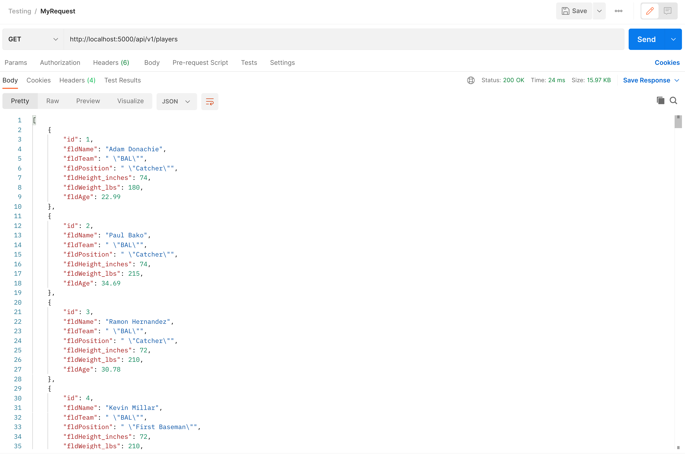
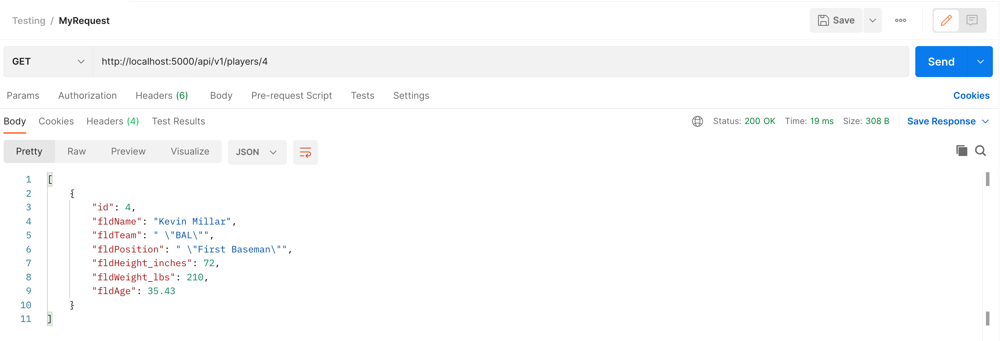
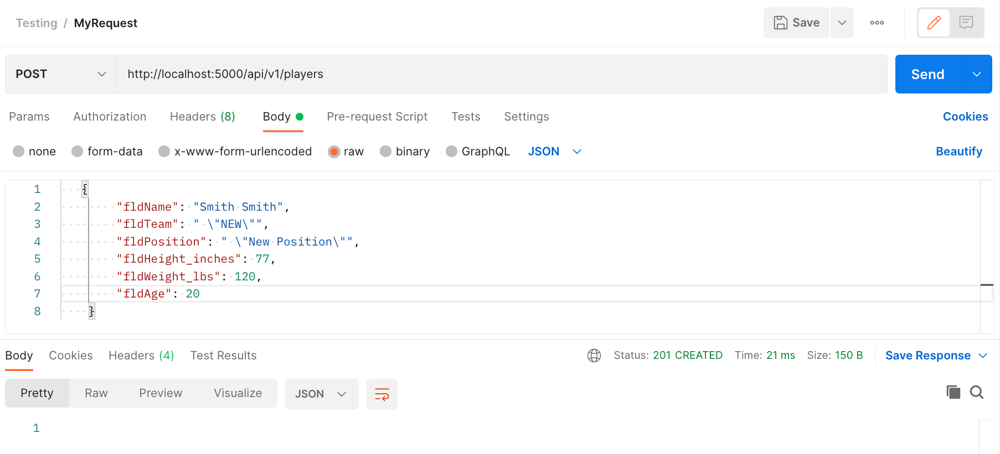
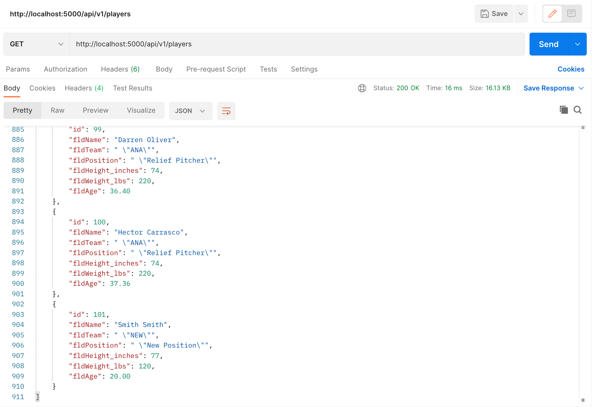
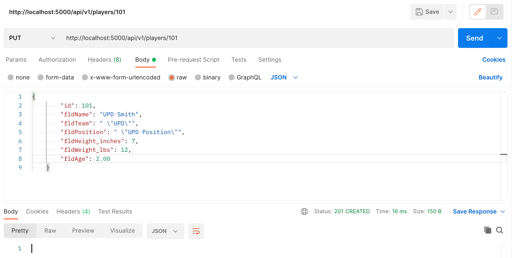
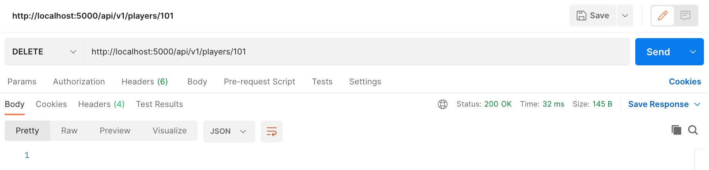
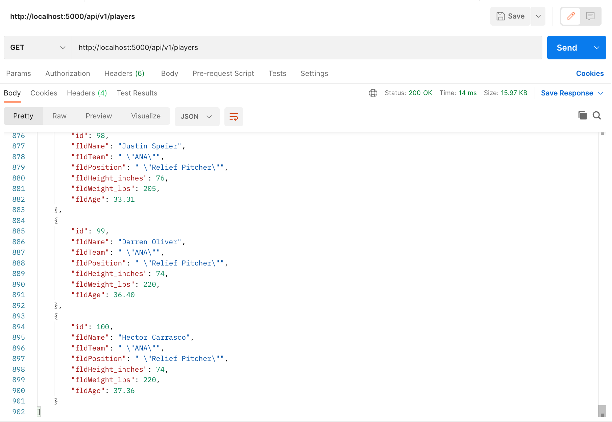

# REST API with Docker, Flask, and MySQL
+ This project is to demonstrate the use of a REST API.
+ Docker Compose is being utilized to setup a python flask app and a mysql server which will load data from
the db/init.sql file during the first start up of the database.
+ The flask framework is being used to create the REST.
+ Postman is being used to test the GET, POST, PUT, and DELETE request methods to verfiy records can be retrieved, created, updated, and deleted.

## Screenshot showing postman listing all records via GET Request:

## Screenshot of postman showing one record via GET request:

## Screenshot showing postman creating a record by showing the POST request:

## Screenshot showing postman list new record in record listing:

## Screenshot showing postman editing a record by showing the PUT request:

## Screenshot showing postman list the edited record in record listing:

## Screenshot showing postman deleting a record by showing the DELETE request:

## Screenshot in postman demonstrating that the record in question has been deleted:

